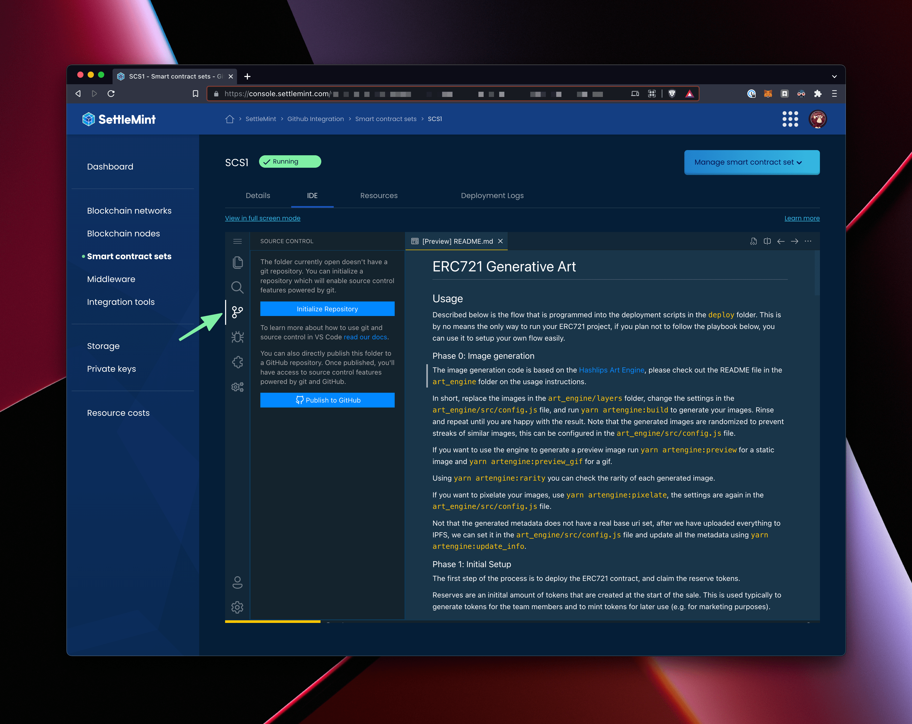
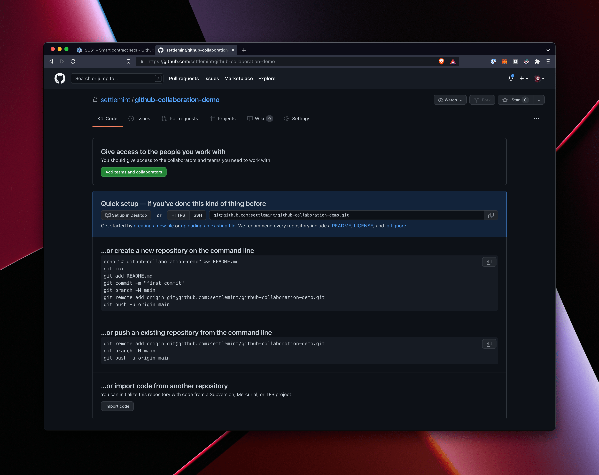
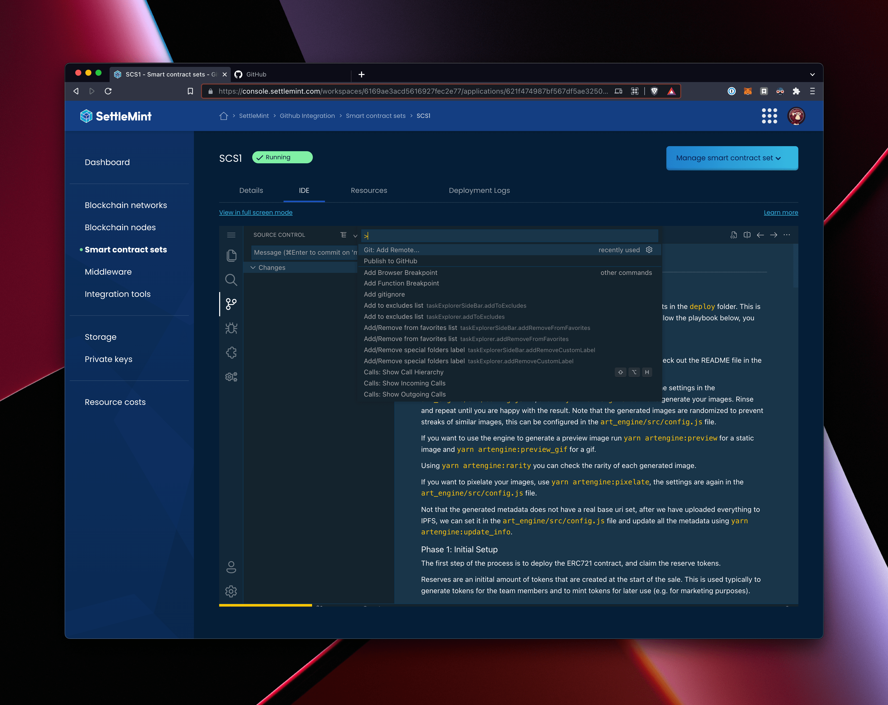
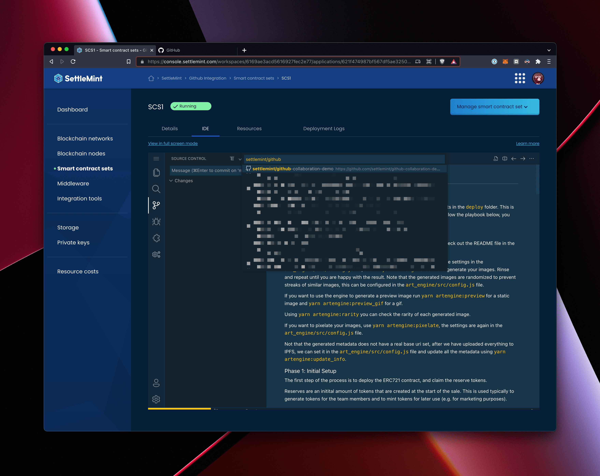
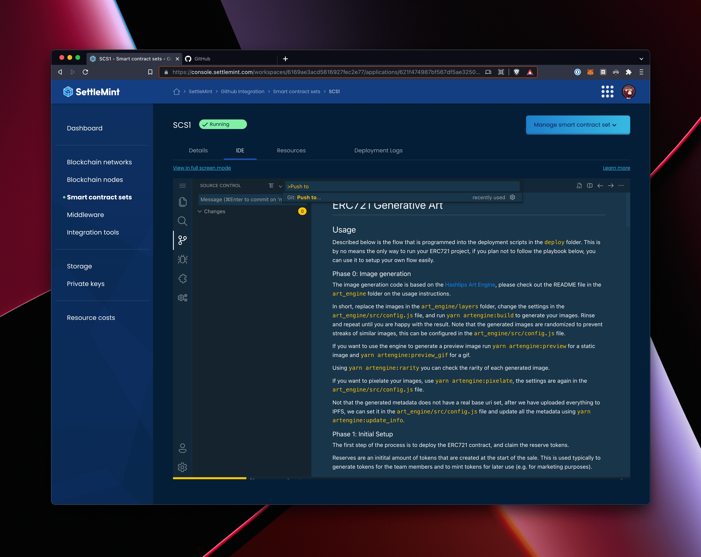
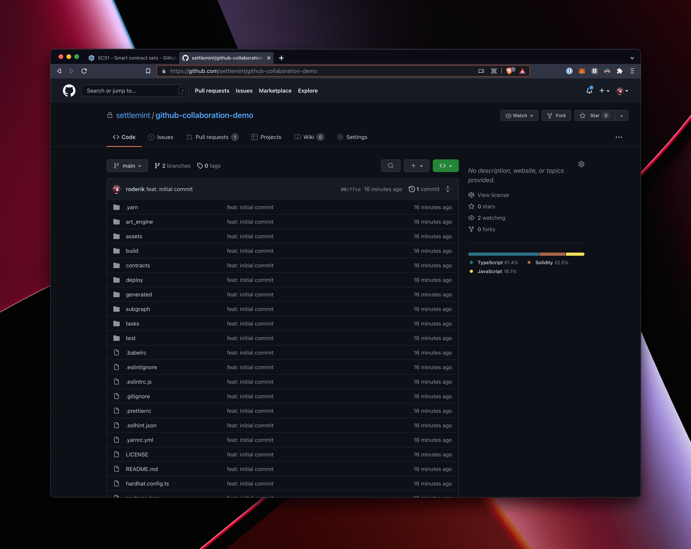
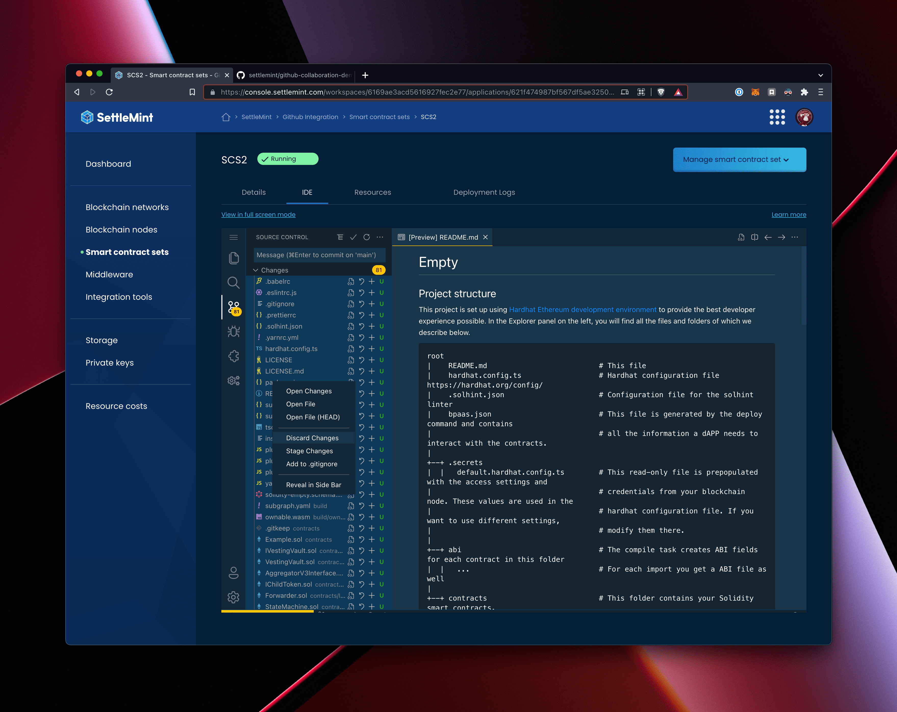

# Developer collaboration using GitHub

## First smart contract set

Let's say you have deployed Smart Contract Sets 1 (SCS1) with any template set and made your changes there.

### Initializing the repository

Select the VCS panel in the sidebar of the IDE, and press the `Initialize Repository` button.

Then stage and commit all files.

### Push the code to GitHub

Create a (private) repository on GitHub.

> Note that the IDE has built in `Publish to GitHub` capabilities, but this will not allow you to publish to an organization.

Press `cmd+shift+p` for mac and `ctrl+shift+p` for windows, and enter “Add Remote”

Then choose "Add remote from GitHub". This will prompt a login to GitHub.

Search for your repository name, in our case `settlemint/github-` is enough to get it to autocomplete the repository.

And name the remote as `origin`. (this is not required to be origin, but it is a convention)

Lastly, `cmd+shift+p` for mac and `ctrl+shift+p` for windows and search for the `Push to...` option

And select the `origin` remote.

If you check GitHub again, you will see the commit and files in the repository.

At this point, your `main` branch is configured to automatically push to this origin, so all the sync options in the VCS tab work without further configuration. 

## Second smart contract set

Now, if another developer wants to work on top of your changes on the above published repository, they need to follow the below steps.

Deploy the smart contract sets by selecting the Empty template and initialize the repository like we did for SCS1

Select the VCS panel in the sidebar of the IDE, and press the `Initialize Repository` button.

Press `cmd+shift+p` for mac and `ctrl+shift+p` for windows, and enter “Add Remote”

Then choose "Add remote from GitHub". This will prompt a login to GitHub.

Search for your repository name, in our case `settlemint/github-` is enough to get it to autocomplete the repository.

And name the remote as `origin`. (this is not required to be origin, but it is a convention)

Next we need to get the repo in a state that we can pull in the GitHub repository. Go to the VCS tab and select all files and `Discard Changes`.

What this does is it removes all the files from the local repository. But since it also removes the `.gitignore` file, it will complain about a few things:

- it will tell you tha tyou are doing this on a branch with no commits yet. This is expected and can be ignored
- then it will also tell you there are too many changes, since all the generated files and node_module folder is now no longer ignored. Again, not an issue, just close them.

Then it is time to press `cmd+shift+p` for mac and `ctrl+shift+p` for windows and search for the `Pull from...` option.
Use the same login / search / origin flow as described above. 

You will end up with no changes and all files from GitHub in your file explorer view. You can now commit, pull and push and work together with your colleagues. 

